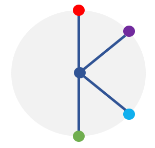

# KONG

Data and software for project KONG (Kernels for ordered neighborhood graphs)

There are two Jupyter notebooks: for general graphs and for graphs with ordered neighborhoods.
Please follow the instructions in the notebooks to run the experiments.
